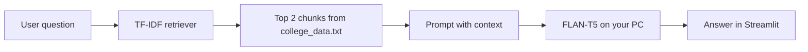

# College FAQ Chatbot (GenAI Project)

A **Retrieval-Augmented Generation (RAG)** chatbot that answers college-related questions using a local knowledge base (`college_data.txt`) and **Google FLAN-T5** running on your computer.

Built for a college GenAI submission with a **Streamlit** chat interface.

---

## What this project does

1. **Retrieve** — Finds the most relevant FAQ paragraphs from `college_data.txt` using **TF-IDF** and cosine similarity.
2. **Generate** — Uses **`google/flan-t5-base`** (Hugging Face Transformers) to write a short answer using only that context.

If the answer is not in the context, the bot is prompted to say *"Information not available"*.

---

## Project structure

```
genai/
├── app_local.py         # Streamlit web app (main demo)
├── college_chatbot.py   # RAG logic: Retriever + LocalGenerator
├── college_data.txt     # College FAQ knowledge base
├── streamlit_ui.py      # Shared Streamlit chat UI
├── requirements.txt     # Python dependencies
├── README.md            # This file
└── output/              # Screenshots for report / viva
    └── README.md        # Suggested screenshot names
```

**Output screenshots:** Save demo images in the **`output/`** folder for your report. See `output/README.md` for naming ideas (e.g. `01_streamlit_home.png`, `02_sample_chat.png`, `03_retrieved_context.png`).

---

## Requirements

- **Python 3.10+**
- **Internet** on first run (downloads FLAN-T5 once, ~1 GB)
- **RAM:** ~4 GB or more recommended
- **Disk:** ~2 GB free for model cache

---

## Installation

Open PowerShell in the project folder:

```powershell
cd "C:\Users\M krishna Prasad\Desktop\genai"
python -m venv .venv
.\.venv\Scripts\activate
pip install -r requirements.txt
```

**Important:** Use **Transformers 4.x** (`transformers>=4.40.0,<5.0.0` in `requirements.txt`). Transformers 5.x removed the `text2text-generation` pipeline task used by older FLAN-T5 examples.

---

## How to run

### Streamlit app (recommended for demo & submission)

```powershell
streamlit run app_local.py
```

Your browser opens at `http://localhost:8501`.

**First run:** Loading FLAN-T5 can take several minutes while the model downloads from Hugging Face. Later runs are faster.

**After the model is cached:** The app can work **offline** (no internet needed for generation).

### What you see in the UI

- Chat interface for questions and answers
- Sidebar with sample questions and project description
- **View retrieved context** expander — shows which knowledge-base chunks were used (useful for viva / report)
- **Clear chat** button to reset the conversation

---

## Model download (first time only)

The first time you run `app_local.py`, Hugging Face downloads **`google/flan-t5-base`** (~1 GB) to your user cache, for example:

`C:\Users\<you>\.cache\huggingface\hub\`

You do **not** need a separate download script — starting the app is enough.

This matches the official Hugging Face usage (`AutoTokenizer` + `AutoModelForSeq2SeqLM`).

---

## How RAG works



---

## Sample questions to try

- When are undergraduate admissions open?
- What B.Tech branches are offered?
- What is the annual tuition fee?
- What are the library timings?
- How can I contact the admin office?

---

## Customizing the knowledge base

1. Edit `college_data.txt`.
2. Write **one topic per paragraph block**.
3. Separate blocks with a **blank line**.
4. Restart Streamlit (stop with `Ctrl+C`, then run `streamlit run app_local.py` again).

---

## Troubleshooting

| Issue | Fix |
|-------|-----|
| `Unknown task text2text-generation` | Install Transformers 4.x: `pip install "transformers>=4.40.0,<5.0.0"` |
| Very slow first response | Normal — model is downloading/loading; wait for the spinner |
| `college_data.txt` not found | Keep the file in the same folder as `app_local.py` |
| Out of memory | Close other apps; ensure ~4 GB RAM free |
| Wrong or vague answers | Rephrase the question; add more detail to `college_data.txt` |

---

## Why local FLAN-T5 (not Hugging Face free API)?

The model **`google/flan-t5-base`** is meant to be loaded with **Transformers on your machine** (as on its [Hugging Face model card](https://huggingface.co/google/flan-t5-base)).

It is **not** available on Hugging Face’s free **Inference Providers** API (“This model isn't deployed by any Inference Provider”). For this project, **local mode** is the correct and supported approach.

---

## Tech stack

| Component | Technology |
|-----------|------------|
| Language | Python |
| Retrieval | scikit-learn (TF-IDF + cosine similarity) |
| Generation | Transformers + PyTorch (`google/flan-t5-base`) |
| Frontend | Streamlit |
| Knowledge base | Plain text (`college_data.txt`) |

---


## License / credits

- Model: [google/flan-t5-base](https://huggingface.co/google/flan-t5-base) (Apache 2.0)
- College GenAI project submission
