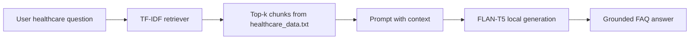

# Domain-Specific Chatbot Using Retrieval-Augmented Generation (RAG) for Healthcare FAQs

A **Retrieval-Augmented Generation (RAG)** system that answers **healthcare domain** frequently asked questions from a curated knowledge base (`healthcare_data.txt`), using **Google FLAN-T5** for grounded text generation and a **Streamlit** chat interface.

> **Disclaimer:** This project is for educational demonstration only. It does not provide medical diagnosis, treatment advice, or emergency services. Always consult qualified healthcare professionals for medical decisions.

---

## Project overview

| Component | Technology | Role |
|-----------|------------|------|
| Knowledge base | `healthcare_data.txt` | Hospital/healthcare FAQ content (appointments, ED, insurance, labs, etc.) |
| Retriever | TF-IDF + cosine similarity (scikit-learn) | Finds top relevant chunks for each user question |
| Generator | `google/flan-t5-base` (Transformers) | Produces answers using **only** retrieved context |
| Frontend | Streamlit (`app.py`) | Interactive chat UI for demos and submission |

### How RAG works



1. **Retrieve** — Rank FAQ paragraphs by similarity to the question.
2. **Generate** — FLAN-T5 writes a short answer constrained to that context.
3. If the fact is missing from the knowledge base, the model is instructed to reply with *"Information not available"*.

---

## Project structure

```
genai/
├── app.py                 # Streamlit chat application (main entry)
├── healthcare_chatbot.py  # RAG pipeline: Retriever + LocalGenerator
├── healthcare_data.txt    # Healthcare FAQ knowledge base
├── streamlit_ui.py        # Shared Streamlit UI components
├── download_model.py      # Optional: pre-download FLAN-T5
├── requirements.txt
├── README.md
└── output/                # Screenshots for report / viva
    └── README.md
```

**Output screenshots:** Save demonstration images in the **`output/`** folder. See `output/README.md` for suggested file names.

---

## Requirements

- **Python 3.10+**
- **Internet** on first run (downloads FLAN-T5 once, ~1 GB)
- **RAM:** ~4 GB recommended
- **Disk:** ~2 GB free for model cache

---

## Installation

```powershell
cd "C:\Users\M krishna Prasad\Desktop\genai"
python -m venv .venv
.\.venv\Scripts\activate
pip install -r requirements.txt
```

Use **Transformers 4.x** (`transformers>=4.40.0,<5.0.0` in `requirements.txt`).

---

## How to run

```powershell
streamlit run app.py
```

Open `http://localhost:8501` in your browser.

**First run:** FLAN-T5 downloads from Hugging Face (~1 GB). This can take several minutes.

**Later runs:** Faster startup; works offline after the model is cached.

### Optional: download model first

```powershell
python download_model.py
```

---

## Sample questions

- How do I book an appointment?
- What are the emergency department hours?
- Does the hospital accept health insurance?
- How can I get my lab test results?
- What are the visiting hours for patients?

Use the sidebar sample buttons in the app, or type your own FAQ-style questions.

---

## Customizing the knowledge base

1. Edit `healthcare_data.txt`.
2. One topic per paragraph block.
3. Separate blocks with a **blank line**.
4. Restart Streamlit after changes.

Example topics: appointments, emergency, visiting hours, insurance, laboratory, pharmacy, telemedicine, billing, vaccinations.

---

## Troubleshooting

| Issue | Fix |
|-------|-----|
| `Unknown task text2text-generation` | `pip install "transformers>=4.40.0,<5.0.0"` |
| Slow first response | Model downloading/loading — wait for spinner |
| `healthcare_data.txt` not found | Keep file in project root next to `app.py` |
| Out of memory | Close other apps; free ~4 GB RAM |
| Vague or wrong answers | Improve FAQ text in `healthcare_data.txt`; rephrase question |

---

## Tech stack

- **Python**
- **scikit-learn** — TF-IDF retrieval
- **Transformers + PyTorch** — FLAN-T5 (`google/flan-t5-base`)
- **Streamlit** — web UI

---

## Academic submission

Include in your report:

1. **Title:** Domain-Specific Chatbot Using RAG for Healthcare FAQs  
2. **Architecture diagram** (retrieve → generate)  
3. **Screenshots** from `output/`:
   - Chat UI home
   - Sample Q&A (e.g. appointments or insurance)
   - **View retrieved context** expander (proves RAG retrieval step)  
4. Note: answers are **grounded** in `healthcare_data.txt`, not open-ended medical advice

---

## License / credits

- Model: [google/flan-t5-base](https://huggingface.co/google/flan-t5-base) (Apache 2.0)
- GenAI academic project — healthcare domain RAG demonstration
